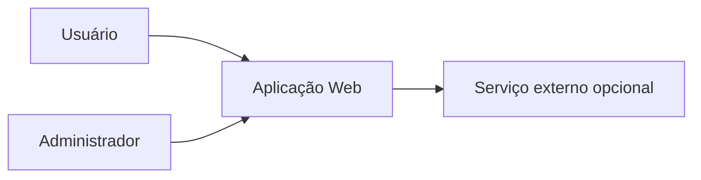
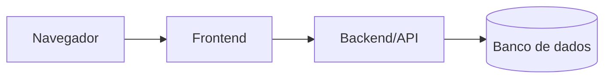
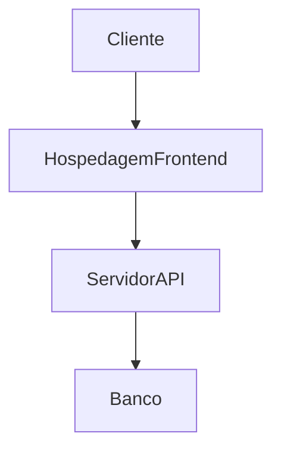

# Arquitetura de software

> **Artefato central da Sprint 6.** A arquitetura descreve a organização global da aplicação, as responsabilidades das partes e suas interações.

## 1. Visão geral

**Estilo arquitetural:** `[camadas, cliente-servidor, MVC, modular monolith, microsserviços etc.]`

**Justificativa:** `[Relacione requisitos, restrições e atributos de qualidade.]`

## 2. Diagrama de contexto

**Descrição:** `[PREENCHER]`

## 3. Diagrama de contêineres/componentes

> Substitua pela arquitetura real. Cada elemento deve apontar para um diretório, módulo ou serviço existente.

## 4. Componentes e responsabilidades

| Componente | Responsabilidade | Tecnologia | Diretório/serviço real | Comunicação |
|---|---|---|---|---|
| `[Frontend]` | `[PREENCHER]` | `[PREENCHER]` | `[link]` | `[HTTP etc.]` |

## 5. Decisões arquiteturais

### DA-01 — `[Título]`

- **Contexto:** `[PREENCHER]`
- **Decisão:** `[PREENCHER]`
- **Requisitos/atributos de qualidade:** `RNF-XX`
- **Consequências e trade-offs:** `[PREENCHER]`
- **Evidência no repositório:** `[link]`

## 6. Implantação e execução

**Ambientes:**

| Ambiente | Endereço ou comando | Finalidade |
|---|---|---|
| Local | `[comando]` | Desenvolvimento e testes |
| Publicado | `[URL]` | Demonstração |

## 7. Riscos arquiteturais

| Risco | Probabilidade | Impacto | Mitigação | Issue |
|---|---|---|---|---|
| `[PREENCHER]` | Média | Alta | `[PREENCHER]` | `#XX` |

## 8. Correspondência arquitetura × código

| Elemento do diagrama | Evidência no código/configuração |
|---|---|
| `[Componente]` | `[link]` |
