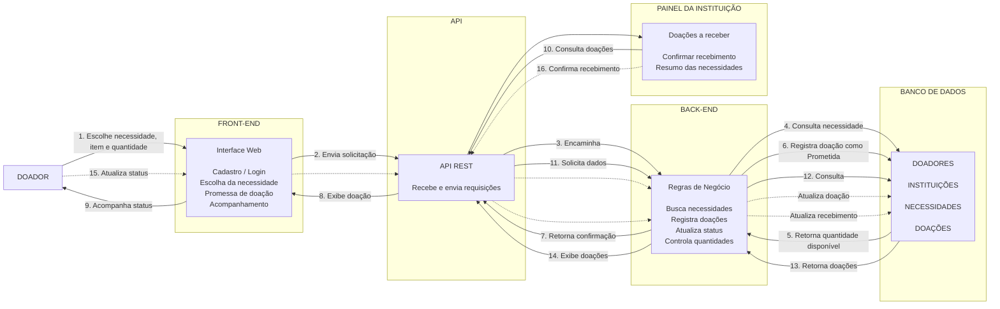
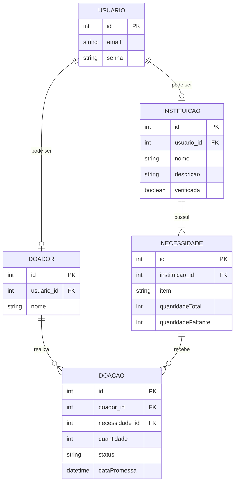

# Modelagem do sistema

> **Artefato central da Sprint 3.** Os modelos devem explicar a estrutura e o comportamento da solução e corresponder aos requisitos e ao código.

Os dois modelos desta sprint cobrem o **fluxo de doação** (comportamental) e o **domínio persistido** (estrutural). Eles não repetem a lista de requisitos — essa continua em [`docs/requisitos/requisitos.md`](../requisitos/requisitos.md), e o vínculo requisito → modelo → código está na [matriz de rastreabilidade](../rastreabilidade.md).

## 1. Modelos selecionados

| Modelo | Tipo | Pergunta que ele ajuda a responder | Requisitos relacionados |
|---|---|---|---|
| Fluxo de doação entre doador, aplicação e instituição | Comportamental | Como ocorre uma doação, do pedido do doador até a confirmação de recebimento? | `RF-19`–`RF-24` |
| Modelo entidade-relacionamento do domínio | Estrutural | Como as entidades se relacionam para conectar doadores a necessidades? | `RF-01`, `RF-02`, `RF-18`, `RF-19` |

O comportamental foi escolhido por ser o fluxo que dá nome ao produto e o único que atravessa os dois perfis de usuário. O estrutural foi escolhido porque a regra de integridade mais sensível do sistema — o saldo de uma necessidade nunca ultrapassar o total desejado (`RNF-06`) — é uma restrição de dados, não de tela, e precisava ser decidida antes de escrever qualquer rota.

## 2. Modelo comportamental

**Descrição e decisões representadas**

O diagrama mostra a comunicação entre doador, front-end, API, back-end, banco de dados e instituição durante o processo de doação.

O fluxo começa com o doador, que acessa a aplicação para escolher uma necessidade, o item que deseja doar e a quantidade. Essas informações são enviadas pela API REST ao back-end, responsável por aplicar as regras de negócio e consultar o banco para verificar a quantidade ainda necessária. Após a validação, o back-end registra a doação com o status `Prometida` e retorna a confirmação ao doador.

O doador acompanha a evolução da doação, que pode passar por `Prometida` → `A caminho` → `Entregue` (`RN-03`). Enquanto estiver nos estados permitidos, a doação pode ser cancelada, devolvendo a quantidade ao saldo da necessidade.

Paralelamente, a instituição possui um painel para consultar as doações a caminho, com doador, item, quantidade e status. Após receber fisicamente uma doação, ela confirma o recebimento e o back-end atualiza os dados. Esses mesmos dados alimentam o resumo por necessidade, com quantidade desejada, prometida, recebida e percentual de atendimento (`RF-24`).

**Decisão representada no desenho:** as arestas 1 a 14 são contínuas e as 15 e 16 são tracejadas porque marcam a fronteira entre o que esta sprint implementou e o que ficou para as seguintes. O caminho contínuo 1→9 é o único exercitável hoje via API; as etapas 10 a 16 dependem de endpoints de consulta e de transição de status que ainda não existem (ver §5).

## 3. Modelo estrutural

**Descrição e decisões representadas**

Um `USUARIO` pode atuar como `DOADOR` ou como `INSTITUICAO` — nunca como os dois. A cardinalidade `||--o|` expressa isso: cada usuário tem no máximo um perfil, e cada perfil pertence a exatamente um usuário.

Uma `INSTITUICAO` possui de uma a muitas `NECESSIDADE` (`||--|{`), o que representa no modelo a exigência do `RF-02` de que o cadastro traga ao menos uma necessidade inicial. Cada necessidade mantém o total desejado (`quantidadeTotal`) e o saldo pendente (`quantidadeFaltante`).

`DOACAO` é a entidade associativa entre `DOADOR` e `NECESSIDADE`, registrando a quantidade comprometida, o estado do ciclo (`status`) e o carimbo de data/hora da promessa (`dataPromessa`).

**Três decisões de modelagem que este diagrama registra:**

1. **Separar identidade de perfil.** `email` e `senha` ficam em `USUARIO`; `nome`, `descricao` e `verificada` ficam nos perfis. Sem essa separação, uma tabela única teria colunas permanentemente nulas para metade das linhas, e o login precisaria saber de antemão qual perfil consultar.
2. **Guardar o saldo, não calculá-lo.** `quantidadeFaltante` é um campo materializado, em vez de uma soma derivada de `DOACAO`. Isso permite travar a linha da necessidade durante a promessa e sustentar o `RNF-06` no próprio banco, ao custo de manter os dois valores coerentes a cada escrita.
3. **Modelar o vínculo como entidade.** `DOACAO` carrega atributos próprios (`quantidade`, `status`, `dataPromessa`), então não podia ser uma tabela de junção simples.

## 4. Relação entre requisitos e modelos

| Requisito | Elemento do modelo | Como está representado | Alteração provocada no backlog/código |
|---|---|---|---|
| `RF-01` | Entidades `USUARIO` e `DOADOR` | `DOADOR` guarda `nome` e referencia `USUARIO` por `usuario_id`; `email` e `senha` ficam só em `USUARIO`. | [#2](https://github.com/gigi-zacaroni/tp-eng-software/issues/2) · Implementado: `POST /cadastro/doador` cria as duas linhas numa transação, com hash bcrypt. |
| `RF-02` | `USUARIO`, `INSTITUICAO` e `NECESSIDADE` | A relação de um para muitos obrigatória entre instituição e necessidade exige ao menos uma necessidade inicial; `verificada` nasce `false`. | [#5](https://github.com/gigi-zacaroni/tp-eng-software/issues/5) · Implementado parcialmente: `POST /cadastro/instituicao` grava `nome` e `descricao`. Causa, cidade e contato ficaram fora do schema — registrado como pendência. |
| `RF-18` | `NECESSIDADE.quantidadeTotal` e `quantidadeFaltante` | O progresso de uma necessidade é a diferença entre os dois campos. | [#10](https://github.com/gigi-zacaroni/tp-eng-software/issues/10) · Os campos existem e são mantidos corretamente, mas não há endpoint que os exponha. |
| `RF-19` | Fluxo comportamental, arestas 1 a 9 | O back-end valida o saldo antes de registrar a doação como `Prometida` e decrementar `quantidadeFaltante`. | [#10](https://github.com/gigi-zacaroni/tp-eng-software/issues/10) · Implementado: `POST /doacoes` sob transação com `SELECT ... FOR UPDATE`. |
| `RF-20` | `DOACAO.status` e aresta 15 | Ciclo `Prometida` → `A caminho` → `Entregue`. | [#11](https://github.com/gigi-zacaroni/tp-eng-software/issues/11) · Não implementado: o campo existe e nasce `Prometida`, mas não há rota de transição. |
| `RF-21` | Aresta 15 + `NECESSIDADE.quantidadeFaltante` | Cancelar devolve a quantidade ao saldo pendente. | [#11](https://github.com/gigi-zacaroni/tp-eng-software/issues/11) · Não implementado. Depende da mesma rota de transição de status. |
| `RF-22` | Arestas 10 a 14 (painel da instituição) | Consulta das doações destinadas à instituição, com doador, item, quantidade e status. | [#12](https://github.com/gigi-zacaroni/tp-eng-software/issues/12) · Não implementado: depende dos endpoints de consulta. |
| `RF-23` | Aresta 16 | Confirmação de recebimento atualiza `DOACAO.status`. | [#12](https://github.com/gigi-zacaroni/tp-eng-software/issues/12) · Não implementado. |
| `RF-24` | `NECESSIDADE` + agregação de `DOACAO` | Resumo por necessidade: desejada, prometida, recebida e percentual. | [#12](https://github.com/gigi-zacaroni/tp-eng-software/issues/12) · Não implementado: a agregação é derivável do modelo, mas não há consulta que a produza. |

## 5. Correspondência entre modelo e código

Os caminhos abaixo são os que existem em `main` no momento da entrega da Sprint 3.

| Elemento modelado | Arquivo correspondente | Observação |
|---|---|---|
| Modelo estrutural inteiro (5 entidades) | [`src/back/sql/schema.sql`](../../src/back/sql/schema.sql) | DDL com as 5 tabelas, FKs nomeadas, `UNIQUE` de e-mail e de perfil, e `CHECK (quantidadeFaltante <= quantidadeTotal)`. Requer MySQL 8.0.16+. |
| `USUARIO`, `DOADOR`, `INSTITUICAO`, `NECESSIDADE` — escrita | [`src/back/src/routes/auth.js`](../../src/back/src/routes/auth.js) | Cadastro de doador (`RF-01`), de instituição com necessidades iniciais (`RF-02`), login (`RF-03`) e logout (`RF-04`). |
| `DOACAO` — criação e decremento do saldo | [`src/back/src/routes/doacoes.js`](../../src/back/src/routes/doacoes.js) | `POST /doacoes` (`RF-19`). Implementa a decisão 2 da §3: `SELECT ... FOR UPDATE` na necessidade antes de gravar. |
| Fluxo comportamental — etapa de acesso que precede o passo 1 | [`src/back/src/middleware/autenticacao.js`](../../src/back/src/middleware/autenticacao.js) | `autenticar` valida o JWT; `exigirTipo` separa doador de instituição. Aplicado hoje apenas em `POST /doacoes`. |
| Nó "BANCO DE DADOS" do fluxo | [`src/back/src/config/db.js`](../../src/back/src/config/db.js) | Pool MySQL e o helper `comTransacao`, que concentra `begin`/`commit`/`rollback`. |
| Validações que o modelo exige antes da persistência | [`src/back/src/utils/validacao.js`](../../src/back/src/utils/validacao.js) · [`http.js`](../../src/back/src/utils/http.js) | Normalização de e-mail, inteiro positivo e a classe `ErroHttp` usada pelo handler central em [`server.js`](../../src/back/src/server.js). |

### Divergências conhecidas entre modelo e código

Registradas aqui em vez de corrigidas no diagrama, porque a decisão de qual lado ajustar é da Sprint 4:

| Divergência | Onde |
|---|---|
| `DOACAO.dataPromessa` existe no modelo estrutural, mas **não** na tabela `doacoes` do schema em uso. Sem ela não há como ordenar ou auditar promessas. | [`src/back/sql/schema.sql`](../../src/back/sql/schema.sql) |
| `INSTITUICAO` foi modelada com `nome` e `descricao` apenas; o `RF-02` e o protótipo preveem também causa, cidade e contato. | [`auth.js`](../../src/back/src/routes/auth.js) |
| Existem **dois** arquivos de schema divergentes: `database/schema.sql` (anterior, com `ON DELETE CASCADE` e `dataPromessa`) e `src/back/sql/schema.sql` (em uso). Não há fonte única. | `database/` e `src/back/sql/` |
| As arestas 10 a 16 do fluxo não têm nenhum código correspondente — não existe endpoint de consulta na API. | — |

## 6. Refinamentos identificados

- **Separação das entidades de usuário.** A modelagem estrutural evidenciou a necessidade de isolar `USUARIO` das tabelas de perfil, evitando atributos nulos recorrentes e simplificando o login: o token JWT passou a carregar `id`, `tipo` e `perfilId` (`RF-03`).
- **Controle transacional no saldo da necessidade.** O diagrama comportamental deixou claro que os passos 4→6 precisam ser atômicos: dois doadores simultâneos poderiam prometer quantidades que, somadas, excedem o saldo. Daí o `SELECT ... FOR UPDATE` e o `CHECK` no banco (`RF-19`, `RF-21`, `RNF-06`).
- **Isolamento da etapa de acesso.** A verificação dos fluxos levou a rotas dedicadas de cadastro e login, verificáveis antes de qualquer doação (`RF-05`).
- **Lacuna descoberta na revisão: o modelo tem leitura, a API não.** As arestas 10 a 14 e os requisitos `RF-06`–`RF-10` descrevem consultas que nenhum endpoint atende. O produto resolve o problema de "descobrir quem ajudar", e essa metade do fluxo não saiu do diagrama. Virou item prioritário do backlog (`T-10`).
- **Lacuna descoberta na revisão: duplicidade de schema.** A existência de dois arquivos DDL divergentes torna ambíguo o que o modelo estrutural representa. Virou item de dívida técnica (`T-09`).

## 7. Histórico de atualização

| Sprint | Modelo alterado | Motivo | Evidência |
|---|---|---|---|
| Sprint 3 | Modelo estrutural — criação | Tradução do domínio para modelo físico MySQL, com a primeira versão da API e do DDL. | [`26b7fd1`](https://github.com/gigi-zacaroni/tp-eng-software/commit/26b7fd135624e5c47428425a190b44c7a0420c23) |
| Sprint 3 | Modelo comportamental — etapa de acesso | Implementação isolada de `RF-01` a `RF-04` para validar cadastro e login antes de integrar o fluxo de doação. | [`f8a059c`](https://github.com/gigi-zacaroni/tp-eng-software/commit/f8a059ce6edf8a187866540f09f167f8134ebca2) · [`2e888a1`](https://github.com/gigi-zacaroni/tp-eng-software/commit/2e888a12a801469910edb78800ee6c6f49f32392) · [`a8c2ff2`](https://github.com/gigi-zacaroni/tp-eng-software/commit/a8c2ff26f4425aa24d986e1c4e7efe630b5d5ff7) · [`0a85290`](https://github.com/gigi-zacaroni/tp-eng-software/commit/0a852902cb4954238172f966bcd244479d22fbf6) |
| Sprint 3 | Ambos — reorganização do back-end | O fluxo completo de doação foi implementado e o código reorganizado em `config/`, `middleware/`, `routes/` e `utils/`, substituindo a primeira versão monolítica. | [`d72574c`](https://github.com/gigi-zacaroni/tp-eng-software/commit/d72574c4cf49a529badbd6d8858ceec19492998f) |
| Sprint 3 | §5 e §6 — correspondência e refinamentos | Revisão final: os caminhos de arquivo citados não existiam mais após a reorganização, e as divergências modelo × código foram registradas explicitamente. | [`ca58383`](https://github.com/gigi-zacaroni/tp-eng-software/commit/ca58383) |
