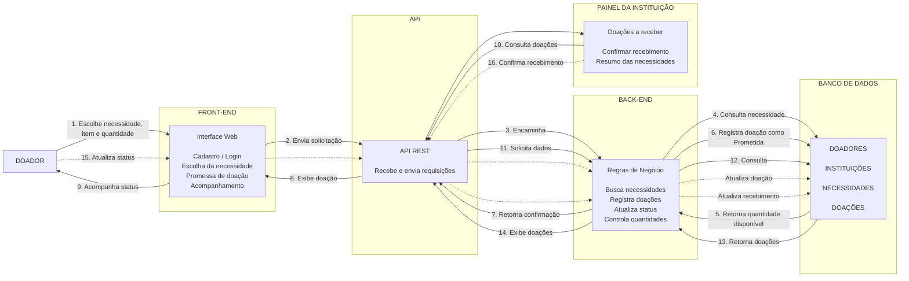
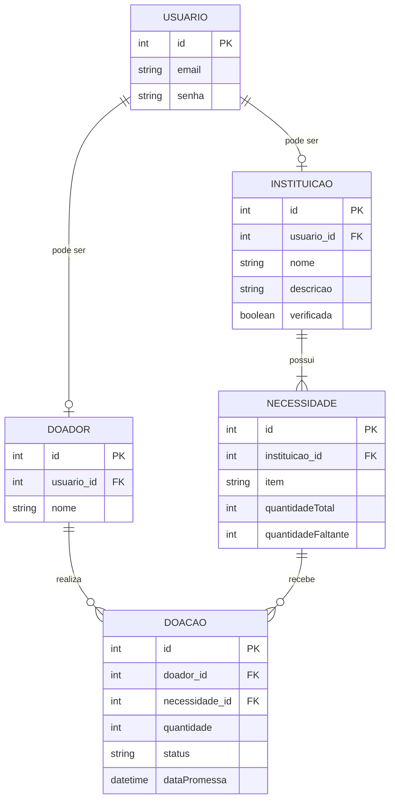

# Modelagem do sistema

> **Artefato central da Sprint 3.** Os modelos devem explicar a estrutura e o comportamento da solução e corresponder aos requisitos e ao código.

## 1. Modelos selecionados

| Modelo | Tipo | Pergunta que ele ajuda a responder | Requisitos relacionados |
|---|---|---|---|
| `[Nome]` | Comportamental | `[Como um fluxo acontece?]` | `RF-XX` |
| `Diagramade classes de Domínio` | Estrutural | `Como as entidades do sistema se relacionam para conectar doadores e necessidades?` | `RF-01, RF-02, RF-18, RF-19` |

## 2. modelo comportamental em Mermaid

>

**Descrição e decisões representadas:** 
O diagrama representa o modelo comportamental da aplicação web, demonstrando como ocorre a comunicação entre o doador, front-end, API, back-end, banco de dados e instituição de caridade durante o processo de doação.
O fluxo começa com o doador, que acessa o front-end da aplicação para escolher uma necessidade, o item que deseja doar e a quantidade. Essas informações são enviadas pela API REST ao back-end, responsável por aplicar as regras de negócio do sistema e consultar o banco de dados para verificar a quantidade que ainda é necessária.Após a validação, o back-end registra a doação no banco de dados com o status "Prometida" e retorna a confirmação ao doador. O sistema também permite que o doador acompanhe a evolução da doação, que pode passar pelos estados "Prometida" → "A caminho" → "Entregue". Caso necessário, a doação também pode ser cancelada enquanto estiver nos estados permitidos, devolvendo a quantidade à necessidade.
Paralelamente, a instituição de caridade possui um painel próprio para consultar as doações que estão a caminho. Nesse painel, são apresentadas informações como doador, item, quantidade e status da doação. Após receber uma doação, a instituição pode confirmar o recebimento, fazendo com que o back-end atualize os dados no banco de dados.
O sistema também utiliza essas informações para apresentar à instituição um resumo de cada necessidade, contendo a quantidade desejada, prometida, recebida e o percentual de atendimento.

## 3. Modelo estrutural em Mermaid

**Descrição e decisões representadas:**  
O modelo representa as principais entidades do sistema e seus relacionamentos. Um `USUARIO` pode atuar como `DOADOR` ou `INSTITUICAO`. Uma instituição pode possuir várias necessidades, enquanto um doador pode realizar várias doações. Cada `DOACAO` relaciona um doador a uma necessidade específica e registra a quantidade, o status e a data da promessa.

**Descrição e decisões representadas:** `[PREENCHER]`

## 4. Relação entre requisitos e modelos

| Requisito | Elemento do modelo | Como está representado | Alteração provocada no backlog/código |
| :--- | :--- | :--- | :--- |
| **RF-01** | Classes `Doador` e `Usuario` | `Doador` possui o atributo `nome` e o método `criarConta()`, herdando `email`, `senha` e `autenticar()` da classe abstrata `Usuario`. | Issue: Criar migration/schema para tabela `Doador` e desenvolver endpoint `POST /doadores` com hash de senha. |
| **RF-02** | Classes `Instituicao` e `Necessidade` | `Instituicao` (herda `Usuario`) possui `descricao` e flag `verificada`. Tem relação de composição (`1..*`) com `Necessidade` para garantir a exigência de itens iniciais. | Issue: Criar schemas de `Instituicao` e `Necessidade`. Desenvolver form multi-step e endpoint `POST /instituicoes` com validação de array de necessidades. |
| **RF-18 e RF-19** | Classe `Doacao` | Entidade associativa que conecta `Doador` e `Necessidade`. Armazena `quantidade`, `status` (ex: "Prometida") e aciona validação pelo método `validarQuantidade()`. | Issue: Criar tabela de vínculo `Doacao`. Implementar endpoint `POST /doacoes` contendo lógica de transação para decrementar `quantidadeFaltante` na Necessidade. |

## 5. Correspondência entre modelo e código

| Elemento modelado | Arquivo/diretório correspondente | Observação |
|---|---|---|
| `[Entidade/componente/fluxo]` | `[link relativo]` | `[PREENCHER]` |

## 6. Refinamentos identificados

- `[Requisito dividido, regra descoberta, entidade adicionada etc.]`

## 7. Histórico de atualização

| Sprint | Modelo alterado | Motivo | Evidência |
|---|---|---|---|
| Sprint 3 | `[PREENCHER]` | `[PREENCHER]` | `[link]` |
