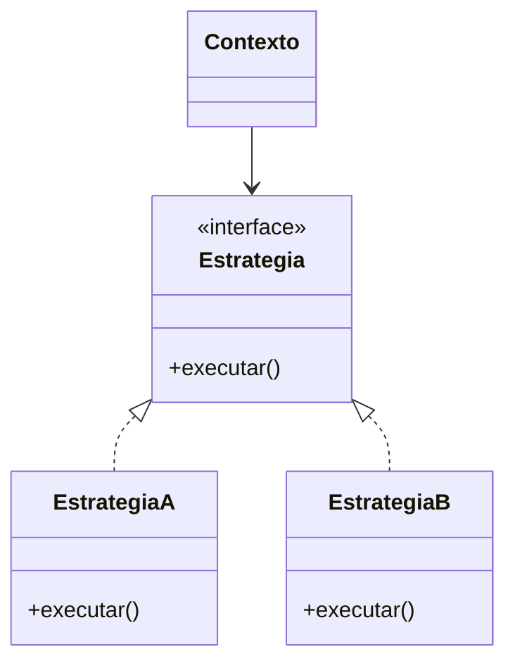

# Padrões de projeto aplicados

> **Artefato central da Sprint 5.** Só registre um padrão quando ele resolver um problema concreto e estiver identificável no código. Não é obrigatório forçar vários padrões.

## 1. Problema recorrente identificado

`[Explique o problema no código antes de mencionar o nome do padrão.]`

## 2. Padrão aplicado

### PP-01 — `[Nome do padrão]`

- **Problema que resolve:** `[PREENCHER]`
- **Contexto no projeto:** `[PREENCHER]`
- **Participantes do padrão no código:** `[classes, módulos ou funções]`
- **Requisitos relacionados:** `RF-XX`, `RNF-XX`
- **Issue/PR:** `[link]`

## 3. Estrutura do padrão

> O diagrama acima é apenas um exemplo de Strategy. Substitua pela representação coerente com o padrão e o código reais.

## 4. Evidência no código

| Papel no padrão | Arquivo/classe/função | Link |
|---|---|---|
| `[Papel]` | `[PREENCHER]` | `[link]` |

## 5. Alternativas e justificativa

| Alternativa | Vantagem | Limitação no contexto do projeto |
|---|---|---|
| `[PREENCHER]` | `[PREENCHER]` | `[PREENCHER]` |

## 6. Resultado observado

`[Explique como a solução ficou mais extensível, testável, coesa ou simples. Não use apenas definições de livro.]`

## 7. Padrões avaliados e não aplicados

| Padrão | Por que não foi necessário ou adequado |
|---|---|
| `[PREENCHER]` | `[PREENCHER]` |
